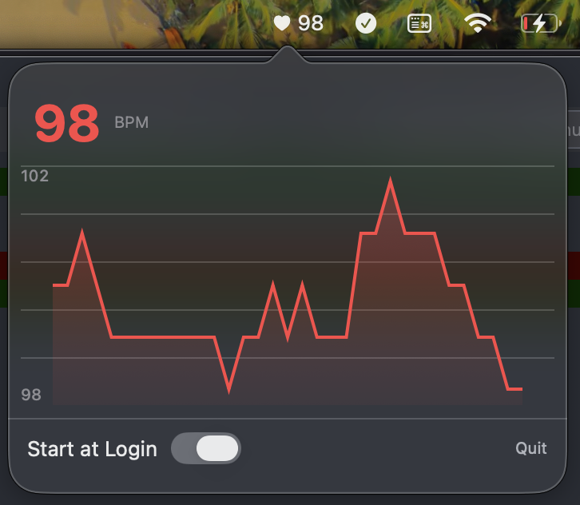

# WHOOP heart rate widget for macOS menu bar

A macOS app that displays your **real-time** heart rate from your WHOOP device via Bluetooth.

## Download

[Download WHOOP Widget v1.0.0](https://github.com/and/whoop-widget-mac/releases/latest/download/WhoopWidget.dmg)

Open the DMG and drag **WHOOP Widget** to your Applications folder.

## Features

- Real-time heart rate monitoring via Bluetooth Low Energy (BLE)
- Displays heart rate in macOS menu bar (♥ 72)
- Compact popover window with heart rate graph
- Automatic connection to your WHOOP device
- Auto-reconnects if connection is lost
- Start at Login option
- Menu-bar-only app (no dock icon)

## Enable HR Broadcast on Your WHOOP

Your WHOOP must be broadcasting heart rate via Bluetooth for the app to connect.

1. Open the WHOOP app on your phone
2. Tap the menu (three lines)
3. Go to **Device Settings**
4. Toggle **HR Broadcast** to **ON**

Note: HR Broadcast may automatically toggle OFF after software/firmware updates, so check this if the app stops connecting.

## How It Works

The app runs in your macOS menu bar and uses Bluetooth Low Energy (BLE) to:
1. Scan for WHOOP devices broadcasting the standard Heart Rate Service
2. Automatically connect when your WHOOP is found
3. Subscribe to real-time heart rate notifications
4. Display your current BPM in the menu bar (♥ 72)
5. Click the menu bar icon to see a larger display in a popover window

### Important Notes

- **Real-Time Data**: This app receives true real-time heart rate data via Bluetooth, updating as fast as your WHOOP broadcasts it
- **HR Broadcast Required**: Your WHOOP must have HR Broadcast enabled in the WHOOP app settings
- **One Device at a Time**: WHOOP can only broadcast to one device at a time, so disconnect from other apps if needed
- **Battery Impact**: HR Broadcast uses more battery on your WHOOP device
- **macOS Bluetooth**: Make sure Bluetooth is enabled on your Mac

## Troubleshooting

### App says "Scanning for WHOOP..." but never connects

1. Make sure **HR Broadcast is ON** in your WHOOP app settings
2. Verify Bluetooth is enabled on your Mac
3. Disconnect WHOOP from other devices (Peloton, Zwift, etc.) - it can only connect to one at a time
4. Try restarting the WHOOP app on your phone to refresh HR Broadcast
5. Make sure your WHOOP is charged and wearing it

### "Bluetooth permission denied"

Grant Bluetooth permission in System Settings > Privacy & Security > Bluetooth

### Connection drops frequently

- Make sure your WHOOP is within range (Bluetooth range is typically 30 feet)
- The app will automatically attempt to reconnect
- Check that HR Broadcast is still enabled (it can turn off after updates)

### No heart rate data showing

- Wait a few seconds after connection
- Make sure you're wearing your WHOOP device
- Check battery level on your WHOOP

## Resources

- [WHOOP Heart Rate Broadcast Guide](https://support.whoop.com/s/article/Heart-Rate-Broadcast)
- [Bluetooth Heart Rate Service Specification](https://www.bluetooth.com/specifications/specs/heart-rate-service-1-0/)

## License

MIT
